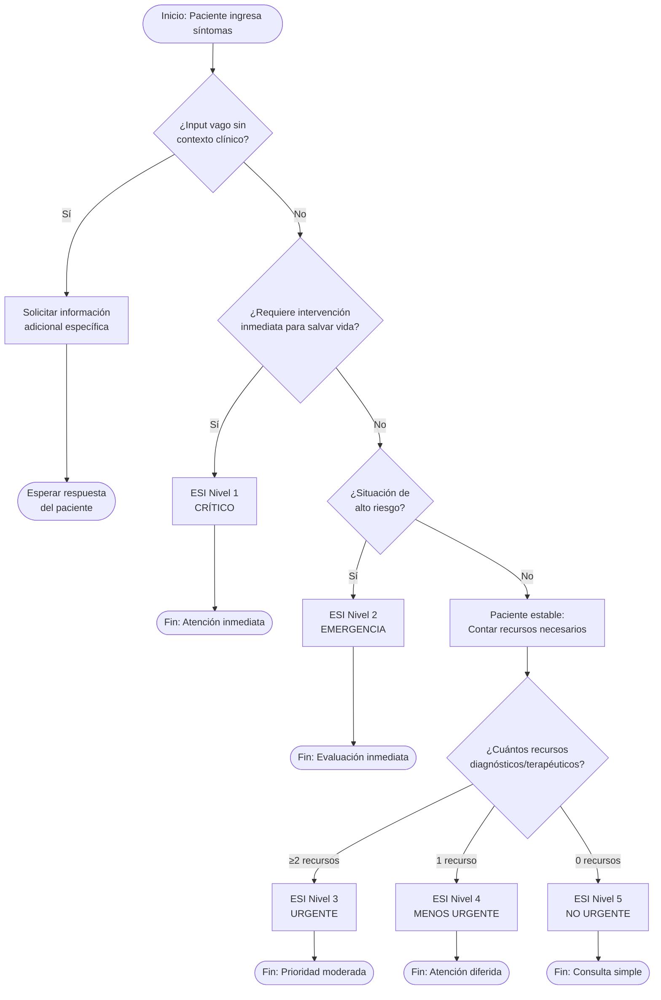
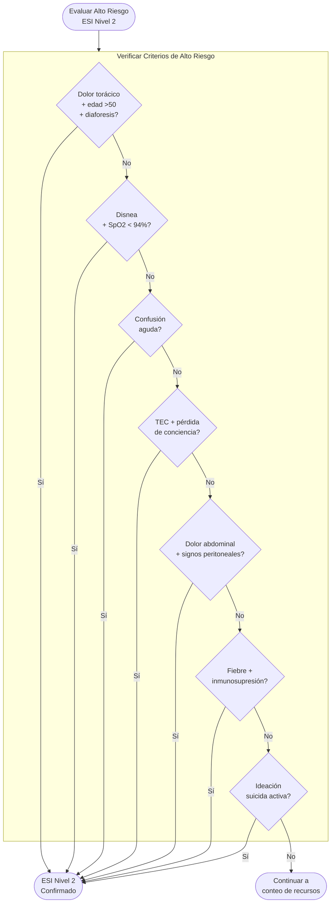
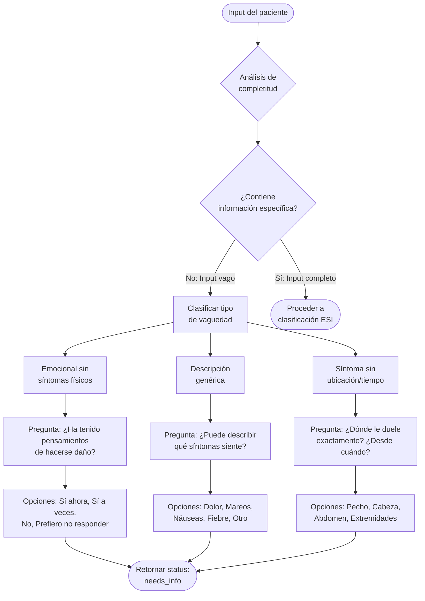

# Estrategia de Desarrollo: Objetivo Específico 1

> **OE1:** Analizar y modelar los flujos clínicos y criterios médicos existentes en los procesos de Triage inicial, identificando variables clave y patrones clínicos relevantes para su digitalización y automatización.

---

## Introducción

El presente capítulo describe la estrategia metodológica empleada para abordar el Objetivo Específico 1, cuyo propósito central consiste en traducir el conocimiento clínico del proceso de Triage al lenguaje formal de la ingeniería de software. Esta fase es fundamentalmente **descriptiva y de modelado**, constituyendo el andamiaje conceptual sobre el cual se construirá posteriormente la arquitectura técnica del sistema (OE3) y su validación clínica (OE4).

El trabajo se estructuró en tres actividades principales:

1. **Revisión y sistematización de protocolos clínicos** → Matriz de Reglas de Decisión
2. **Definición del diccionario de datos** → Variables clave con codificación estándar
3. **Modelado de procesos** → Diagramas de flujo lógico del algoritmo clínico

---

## Actividad 1: Revisión y Sistematización de Protocolos Clínicos

### 1.1 Objetivo

Documentar de forma explícita y estructurada las reglas de decisión clínica que el sistema de inteligencia artificial debe seguir para la categorización de pacientes según el protocolo Emergency Severity Index (ESI).

### 1.2 Metodología

Se realizó un análisis documental exhaustivo de las siguientes fuentes:

| Fuente | Descripción | Uso Principal |
|--------|-------------|---------------|
| **ESI Implementation Handbook v4** | Manual oficial de implementación del ESI | Criterios de clasificación niveles 1-5 |
| **Normativa MINSAL** | Orientación técnica de categorización de urgencias en Chile | Adaptación al contexto nacional |
| **Guías clínicas institucionales** | Protocolos locales de servicios de urgencia | Validación de aplicabilidad local |

### 1.3 Producto: Matriz de Reglas de Decisión Clínica

La base de conocimiento se estructuró como una matriz de reglas condicionales que mapean combinaciones de síntomas, signos y antecedentes a niveles ESI específicos.

#### Tabla 1: Matriz de Reglas para ESI Nivel 1 (Crítico)

| ID Regla | Condición Clínica | Signos/Síntomas Asociados | Nivel ESI | Acción Sugerida |
|----------|-------------------|---------------------------|-----------|-----------------|
| R1.1 | Paro cardiorrespiratorio | Ausencia de pulso, apnea | ESI 1 | Reanimación inmediata |
| R1.2 | Compromiso de vía aérea severo | Estridor, cianosis, uso de musculatura accesoria | ESI 1 | Manejo de vía aérea |
| R1.3 | Alteración de conciencia severa | GCS ≤ 10, respuesta solo al dolor | ESI 1 | Evaluación neurológica urgente |
| R1.4 | Sangrado arterial activo | Hemorragia no controlada, hipotensión | ESI 1 | Control hemostático |
| R1.5 | Shock | Hipotensión + taquicardia + alteración perfusión | ESI 1 | Reanimación con volumen |
| R1.6 | Crisis convulsiva activa | Convulsiones tónico-clónicas en curso | ESI 1 | Protocolo anticonvulsivante |

#### Tabla 2: Matriz de Reglas para ESI Nivel 2 (Emergencia - Alto Riesgo)

| ID Regla | Condición Clínica | Criterios Específicos | Nivel ESI | Especialidad Sugerida |
|----------|-------------------|----------------------|-----------|----------------------|
| R2.1 | Dolor torácico sugestivo de SCA | Dolor opresivo + irradiación + diaforesis + edad >50 años | ESI 2 | Cardiología/UCI |
| R2.2 | Dificultad respiratoria moderada-severa | Disnea + saturación <94% + FR >24/min | ESI 2 | Medicina Interna |
| R2.3 | Alteración del estado mental | Confusión aguda, desorientación, delirium | ESI 2 | Neurología/Medicina |
| R2.4 | TEC con pérdida de conciencia | Trauma craneal + LOC + amnesia del evento | ESI 2 | Neurocirugía |
| R2.5 | Dolor abdominal con signos peritoneales | Dolor intenso + rigidez abdominal + defensa | ESI 2 | Cirugía |
| R2.6 | Fiebre en inmunocomprometido | T° >38.3°C + quimioterapia/VIH/trasplante | ESI 2 | Infectología |
| R2.7 | Ideación suicida activa | Verbalización de intención autolesiva | ESI 2 | Psiquiatría |
| R2.8 | Quemaduras extensas | >20% superficie corporal o vía aérea | ESI 2 | Quemados/UCI |

#### Tabla 3: Matriz de Reglas para ESI Niveles 3-5 (Basado en Recursos)

| Nivel ESI | Criterio Principal | Ejemplos de Recursos | Condiciones Clínicas Típicas |
|-----------|-------------------|---------------------|------------------------------|
| **ESI 3** | ≥2 recursos | Laboratorios múltiples, imágenes (Rx, TAC, ECO), procedimientos (sutura, yeso), medicación IV | Dolor abdominal estable, fiebre sin foco, cefalea intensa sin banderas rojas |
| **ESI 4** | 1 recurso | Un laboratorio, una radiografía simple, medicación oral/IM | Contusión menor, cuadro febril simple, síntomas urinarios bajos |
| **ESI 5** | 0 recursos | Solo anamnesis y examen físico | Renovación de receta, consulta no urgente, malestar general leve |

### 1.4 Validación de Reglas

> [!IMPORTANT]
> **Proceso de Validación Experta Recomendado**
> 
> Se recomienda someter la matriz de reglas a validación por profesionales de enfermería expertos en Triage, idealmente mediante:
> - Entrevistas semiestructuradas con enfermeros/as categorizadores/as
> - Revisión por pares clínicos (co-directores de tesis)
> - Análisis de casos clínicos reales para verificar aplicabilidad

---

## Actividad 2: Definición del Diccionario de Datos

### 2.1 Objetivo

Establecer el conjunto mínimo de variables (inputs) que el sistema requiere para realizar la categorización, asegurando su interoperabilidad mediante la adopción de estándares terminológicos internacionales.

### 2.2 Estándares Terminológicos Adoptados

| Estándar | Propósito | Uso en el Sistema |
|----------|-----------|-------------------|
| **SNOMED CT** | Nomenclatura clínica sistematizada | Codificación de síntomas, signos y hallazgos clínicos |
| **LOINC** | Identificadores lógicos de observaciones | Codificación de signos vitales y mediciones |
| **HL7 FHIR R4** | Estándar de interoperabilidad | Estructuración de recursos clínicos |

### 2.3 Producto: Diccionario de Datos Estructurado

#### Tabla 4: Variables de Identificación y Consentimiento

| Variable | Tipo de Dato | Código Estándar | Obligatoriedad | Regla de Validación |
|----------|--------------|-----------------|----------------|---------------------|
| `patient_id` | UUID | N/A (identificador interno) | Obligatorio | Generación automática |
| `patient_consent` | Boolean | N/A | Obligatorio | Debe ser `true` para continuar |
| `created_at` | Timestamp | N/A | Obligatorio | ISO 8601 |

#### Tabla 5: Variables de Síntomas Principales

| Variable | Tipo de Dato | Código SNOMED CT | Obligatoriedad | Dominio de Valores |
|----------|--------------|------------------|----------------|-------------------|
| `chest_pain` | Boolean | 29857009 | Condicional | true/false |
| `dyspnea` | Boolean | 267036007 | Condicional | true/false |
| `abdominal_pain` | Boolean | 21522001 | Condicional | true/false |
| `headache` | Boolean | 25064002 | Condicional | true/false |
| `fever` | Boolean | 386661006 | Condicional | true/false |
| `altered_consciousness` | Boolean | 40917007 | Condicional | true/false |
| `trauma` | Boolean | 417746004 | Condicional | true/false |
| `bleeding` | Boolean | 131148009 | Condicional | true/false |
| `suicidal_ideation` | Boolean | 6471006 | Condicional | true/false |
| `symptoms_text` | Text | N/A (narrativo) | Obligatorio | Texto libre sanitizado |

#### Tabla 6: Variables de Signos Vitales

| Variable | Tipo de Dato | Código LOINC | Obligatoriedad | Rango Válido | Unidad |
|----------|--------------|--------------|----------------|--------------|--------|
| `heart_rate` | Integer | 8867-4 | Opcional | 30-250 | lpm |
| `respiratory_rate` | Integer | 9279-1 | Opcional | 8-60 | rpm |
| `oxygen_saturation` | Integer | 2708-6 | Opcional | 50-100 | % |
| `systolic_bp` | Integer | 8480-6 | Opcional | 50-300 | mmHg |
| `diastolic_bp` | Integer | 8462-4 | Opcional | 30-200 | mmHg |
| `temperature` | Decimal | 8310-5 | Opcional | 32.0-42.0 | °C |
| `pain_scale` | Integer | 72514-3 | Opcional | 0-10 | EVA |

#### Tabla 7: Variables de Antecedentes Relevantes

| Variable | Tipo de Dato | Código SNOMED CT | Obligatoriedad | Descripción |
|----------|--------------|------------------|----------------|-------------|
| `age` | Integer | N/A | Obligatorio | Edad en años (≥18) |
| `immunocompromised` | Boolean | 370388006 | Opcional | Inmunosupresión activa |
| `pregnancy` | Boolean | 77386006 | Condicional | Estado de gestación |
| `diabetes` | Boolean | 73211009 | Opcional | Diabetes mellitus |
| `cardiac_history` | Boolean | 56265001 | Opcional | Antecedente cardiovascular |
| `recent_surgery` | Boolean | 387713003 | Opcional | Cirugía en últimos 30 días |

#### Tabla 8: Variables de Salida (Output del Sistema)

| Variable | Tipo de Dato | Código FHIR | Obligatoriedad | Dominio de Valores |
|----------|--------------|-------------|----------------|-------------------|
| `esi_level` | Integer | RiskAssessment.prediction | Obligatorio | 1, 2, 3, 4, 5 |
| `critical_signs` | Array[String] | RiskAssessment.prediction.qualitativeRisk | Obligatorio | Lista de signos detectados |
| `reasoning` | Text | RiskAssessment.note | Obligatorio | Explicación del algoritmo |
| `suggested_specialty` | String | RiskAssessment.performer | Opcional | Especialidad médica |
| `status` | String | N/A | Obligatorio | 'complete' \| 'needs_info' |

---

## Actividad 3: Modelado de Procesos del Algoritmo Clínico

### 3.1 Objetivo

Diseñar representaciones gráficas del flujo lógico que seguirá el sistema de IA para la toma de decisiones, utilizando notaciones estándar de modelado de procesos.

### 3.2 Diferenciación con Diagramas Existentes

> [!NOTE]
> **Distinción Conceptual Importante**
> 
> El diagrama BPMN presentado en la Figura 1 del proyecto de tesis describe el **flujo del estudio** (proceso de validación con pacientes). Los diagramas desarrollados en esta actividad modelan el **algoritmo clínico interno** del sistema de IA.

### 3.3 Diagrama de Flujo del Algoritmo ESI

### 3.4 Árbol de Decisión para ESI Nivel 2 (Alto Riesgo)

### 3.5 Modelo de Decisión para Manejo de Vaguedad Clínica

---

## Síntesis y Productos Obtenidos

### Resumen de Entregables del OE1

| Actividad | Producto | Formato | Estado |
|-----------|----------|---------|--------|
| Revisión de Protocolos | Matriz de Reglas de Decisión (Tablas 1-3) | Tabular estructurado | Completo |
| Diccionario de Datos | Variables con codificación SNOMED/LOINC (Tablas 4-8) | Tabular normalizado | Completo |
| Modelado de Procesos | Diagramas de flujo algoritmo ESI | Notación Mermaid/BPMN | Completo |

### Contribución al Sistema

Los productos generados en esta fase constituyen la **base de conocimiento formal** que será implementada en:

1. **El prompt del sistema de IA** (`lib/ai/prompts.ts`): Las reglas de decisión se codificaron como instrucciones estructuradas para el modelo de lenguaje.
2. **El esquema de base de datos** (`clinical_records`): Las variables del diccionario de datos definen la estructura de almacenamiento.
3. **La lógica de validación**: Los diagramas de flujo guían la implementación del algoritmo de clasificación.

---

## Referencias Metodológicas

1. Emergency Nurses Association. (2020). *Emergency Severity Index (ESI): A Triage Tool for Emergency Department Care, Version 4*.
2. MINSAL Chile. (2019). *Orientación Técnica: Organización y funcionamiento de las Unidades de Emergencia Hospitalaria*.
3. SNOMED International. (2023). *SNOMED CT Browser*. https://browser.ihtsdotools.org
4. Regenstrief Institute. (2023). *LOINC Database*. https://loinc.org
5. HL7 International. (2019). *HL7 FHIR R4 Specification*. https://hl7.org/fhir/R4

---

> **Nota del Autor:** Este documento fue elaborado como parte del desarrollo metodológico de la tesis de Magíster en Informática Médica, Universidad de Chile. Los contenidos están sujetos a validación experta antes de su implementación definitiva.
