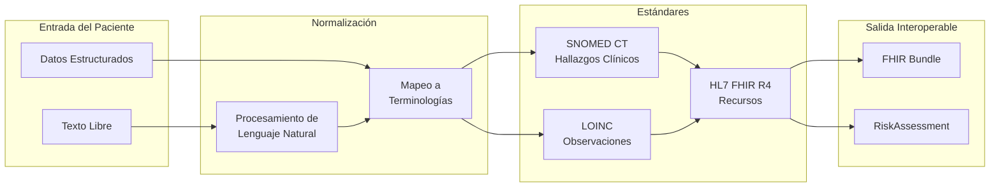
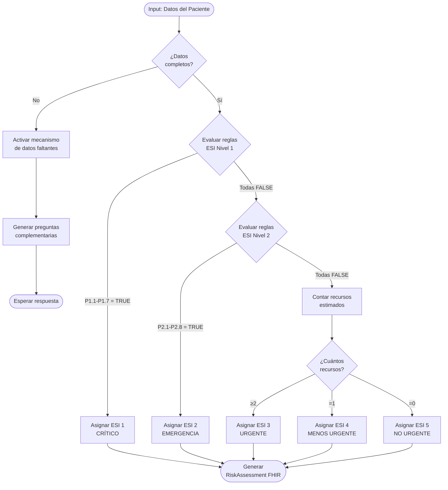
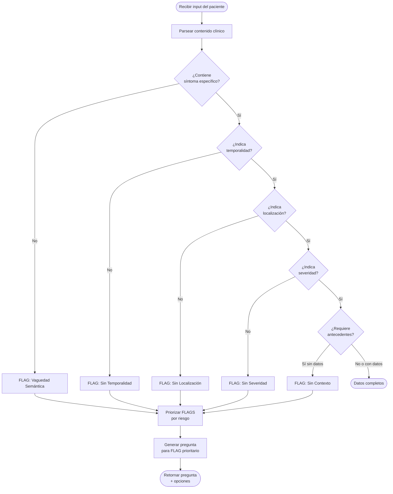
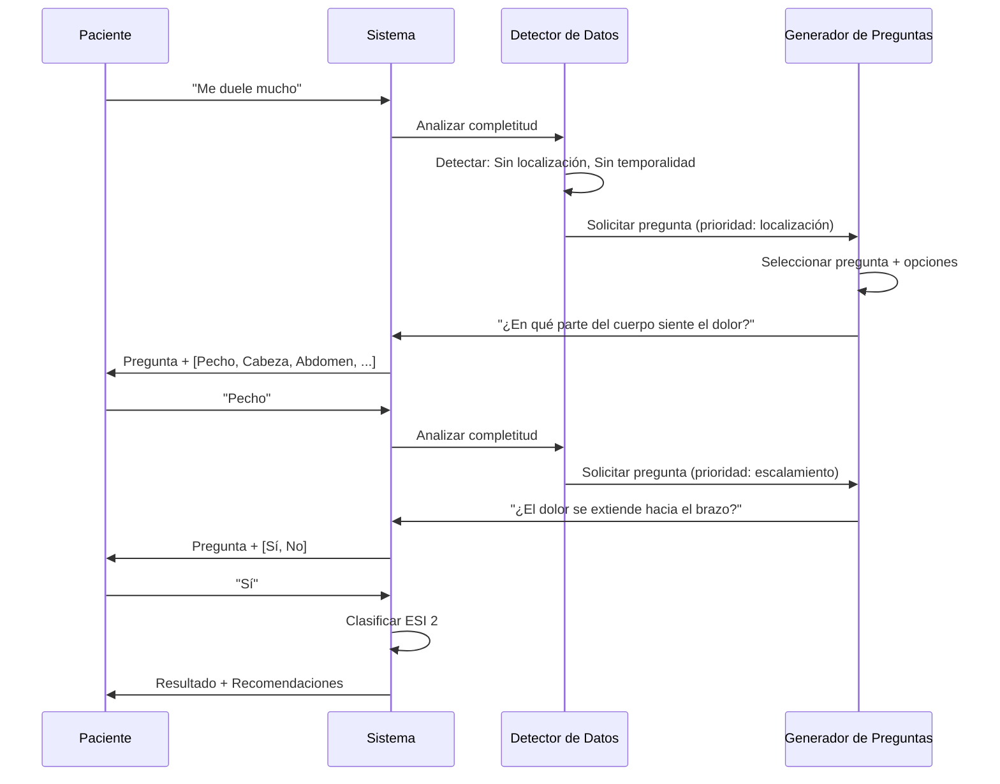

# Estrategia de Desarrollo: Objetivo Específico 2

> **OE2:** Definir y estructurar el conjunto mínimo de variables clínicas y operativas necesarias para la automatización del Triage, estableciendo reglas y condiciones lógicas que permitan la priorización de pacientes, incluyendo mecanismos para detectar datos faltantes y generar preguntas complementarias.

---

## Introducción

El Objetivo Específico 2 constituye el puente entre el modelado conceptual (OE1) y la implementación técnica (OE3). Mientras el OE1 estableció las reglas clínicas y el diccionario de datos inicial, el OE2 profundiza en tres aspectos críticos para la operacionalización del sistema:

1. **Estructuración del Conjunto Mínimo de Datos (CMD)**: Definición formal de las variables indispensables según estándares de interoperabilidad.
2. **Reglas lógicas de priorización**: Condiciones computacionales para la asignación de niveles ESI.
3. **Mecanismos de completitud**: Detección de datos faltantes y generación dinámica de preguntas complementarias.

> [!NOTE]
> **Relación con OE1**
> 
> El OE1 definió *qué* variables son necesarias y *cómo* se relacionan con la clasificación ESI. El OE2 define *cómo* se estructuran estas variables para interoperabilidad, *cómo* el sistema decide prioridades, y *qué hacer* cuando la información es incompleta.

---

## Actividad 1: Definición del Conjunto Mínimo de Datos (CMD)

### 1.1 Objetivo

Establecer el **Conjunto Mínimo de Datos** requerido para la automatización del Triage, siguiendo principios de parsimonia clínica (mínima información necesaria para máxima precisión) y cumplimiento regulatorio.

### 1.2 Marco Normativo

| Normativa | Jurisdicción | Requisitos Relevantes |
|-----------|--------------|----------------------|
| **Ley 21.541** | Chile | Interoperabilidad en salud, uso de estándares internacionales |
| **Ley 21.668** | Chile | Transformación digital en salud, ficha clínica electrónica |
| **Ley 19.628** | Chile | Protección de datos personales |
| **HL7 Chile** | Chile | Guía de implementación local de FHIR |

### 1.3 Categorización de Variables por Criticidad

#### Tabla 1: Clasificación de Variables según Obligatoriedad y Criticidad

| Categoría | Descripción | Comportamiento del Sistema |
|-----------|-------------|---------------------------|
| **CRÍTICA** | Imprescindible para clasificación segura | Sistema NO puede clasificar sin esta variable |
| **ALTA** | Modifica significativamente la clasificación | Sistema solicita activamente si está ausente |
| **MEDIA** | Mejora precisión de clasificación | Sistema sugiere proporcionar si es relevante |
| **BAJA** | Información complementaria | Sistema acepta sin solicitar |

#### Tabla 2: Conjunto Mínimo de Datos - Variables Críticas

| Variable | Categoría | Justificación Clínica | Impacto si Falta |
|----------|-----------|----------------------|------------------|
| `symptoms_description` | CRÍTICA | Motivo de consulta principal | Clasificación imposible |
| `symptom_onset` | CRÍTICA | Temporalidad determina urgencia | Riesgo de sub-triage en condiciones agudas |
| `pain_severity` | ALTA | Discriminador ESI principal | Subestimación de urgencia |
| `symptom_location` | ALTA | Orienta hacia sistema afectado | Clasificación imprecisa |
| `age` | ALTA | Modifica umbrales de riesgo | Aplicación incorrecta de criterios |
| `vital_signs_abnormal` | ALTA | Indicador de inestabilidad | Riesgo de sub-triage ESI 1-2 |

#### Tabla 3: Conjunto Mínimo de Datos - Variables de Alta Prioridad

| Variable | Código SNOMED CT | Condición de Solicitud | Pregunta Asociada |
|----------|------------------|----------------------|-------------------|
| `chest_pain_characteristics` | 29857009 | Si `symptoms_description` contiene "dolor de pecho" | ¿El dolor es opresivo, punzante o quemante? |
| `dyspnea_severity` | 267036007 | Si se detecta dificultad respiratoria | ¿Qué tan difícil le resulta respirar? |
| `consciousness_level` | 40917007 | Si se detecta confusión o alteración | ¿Se siente confundido o desorientado? |
| `bleeding_site` | 131148009 | Si se detecta sangrado | ¿De dónde está sangrando? ¿Cuánta sangre? |
| `trauma_mechanism` | 417746004 | Si se detecta lesión traumática | ¿Cómo ocurrió la lesión? |
| `fever_duration` | 386661006 | Si se detecta fiebre | ¿Desde cuándo tiene fiebre? ¿Ha tomado su temperatura? |

---

## Actividad 2: Mapeo a Estándares de Interoperabilidad

### 2.1 Objetivo

Asegurar que todas las variables del CMD estén correctamente mapeadas a estándares internacionales, permitiendo la interoperabilidad con sistemas de información en salud (HIS) nacionales e internacionales.

### 2.2 Arquitectura de Interoperabilidad



### 2.3 Mapeo SNOMED CT para Hallazgos Clínicos

#### Tabla 4: Mapeo de Síntomas a SNOMED CT

| Término en Español | Código SNOMED CT | Nombre Oficial (EN) | Jerarquía |
|--------------------|------------------|---------------------|-----------|
| Dolor de pecho | 29857009 | Chest pain | Clinical finding |
| Dificultad para respirar | 267036007 | Dyspnea | Clinical finding |
| Dolor abdominal | 21522001 | Abdominal pain | Clinical finding |
| Dolor de cabeza | 25064002 | Headache | Clinical finding |
| Fiebre | 386661006 | Fever | Clinical finding |
| Confusión | 40917007 | Confusion | Clinical finding |
| Sangrado | 131148009 | Hemorrhage | Clinical finding |
| Náuseas | 422587007 | Nausea | Clinical finding |
| Vómitos | 422400008 | Vomiting | Clinical finding |
| Mareos | 404640003 | Dizziness | Clinical finding |
| Debilidad | 13791008 | Asthenia | Clinical finding |
| Palpitaciones | 80313002 | Palpitations | Clinical finding |
| Desmayo | 271594007 | Syncope | Clinical finding |
| Convulsiones | 91175000 | Seizure | Clinical finding |
| Tos | 49727002 | Cough | Clinical finding |

#### Tabla 5: Mapeo de Antecedentes a SNOMED CT

| Condición | Código SNOMED CT | Relevancia para Triage |
|-----------|------------------|----------------------|
| Diabetes mellitus | 73211009 | Modifica umbrales de infección |
| Hipertensión arterial | 38341003 | Riesgo cardiovascular |
| Enfermedad coronaria | 53741008 | Alto riesgo ante dolor torácico |
| Insuficiencia cardíaca | 84114007 | Riesgo de descompensación |
| EPOC/Asma | 13645005 / 195967001 | Riesgo respiratorio |
| Inmunosupresión | 370388006 | Riesgo de infección severa |
| Enfermedad renal crónica | 709044004 | Alteración metabólica |
| Cáncer activo | 363346000 | Múltiples complicaciones |
| Embarazo | 77386006 | Población especial |
| Cirugía reciente (<30 días) | 387713003 | Riesgo de complicaciones |

### 2.4 Mapeo LOINC para Observaciones y Mediciones

#### Tabla 6: Mapeo de Signos Vitales a LOINC

| Observación | Código LOINC | Nombre Oficial | Unidad | Valores Críticos |
|-------------|--------------|----------------|--------|------------------|
| Frecuencia cardíaca | 8867-4 | Heart rate | /min | <50 o >120 |
| Frecuencia respiratoria | 9279-1 | Respiratory rate | /min | <10 o >24 |
| Saturación de oxígeno | 2708-6 | Oxygen saturation | % | <94% |
| Presión arterial sistólica | 8480-6 | Systolic blood pressure | mm[Hg] | <90 o >180 |
| Presión arterial diastólica | 8462-4 | Diastolic blood pressure | mm[Hg] | >110 |
| Temperatura corporal | 8310-5 | Body temperature | Cel | <35.5 o >38.3 |
| Escala de dolor | 72514-3 | Pain severity | {score} | ≥7 |
| Glasgow Coma Scale | 9269-2 | Glasgow coma score | {score} | ≤13 |

### 2.5 Estructura HL7 FHIR para Triage

#### Recurso FHIR: RiskAssessment (Evaluación de Riesgo)

```json
{
  "resourceType": "RiskAssessment",
  "id": "triage-assessment-001",
  "meta": {
    "profile": ["http://hl7.org/fhir/StructureDefinition/RiskAssessment"]
  },
  "status": "final",
  "method": {
    "coding": [{
      "system": "http://terminology.hl7.org/CodeSystem/risk-assessment-method",
      "code": "ESI",
      "display": "Emergency Severity Index"
    }]
  },
  "subject": {
    "reference": "Patient/anonymous-patient-001"
  },
  "occurrenceDateTime": "2026-01-08T00:00:00-03:00",
  "performer": {
    "reference": "Device/ai-triage-system"
  },
  "prediction": [{
    "outcome": {
      "coding": [{
        "system": "http://snomed.info/sct",
        "code": "225390008",
        "display": "Triage"
      }],
      "text": "ESI Level 2 - Emergencia"
    },
    "qualitativeRisk": {
      "coding": [{
        "system": "http://terminology.hl7.org/CodeSystem/risk-probability",
        "code": "high",
        "display": "Alto riesgo"
      }]
    }
  }],
  "basis": [{
    "reference": "Observation/symptom-chest-pain"
  }, {
    "reference": "Observation/vital-signs"
  }],
  "note": [{
    "text": "Dolor torácico con características isquémicas en paciente mayor de 50 años. Requiere evaluación cardiológica inmediata."
  }]
}
```

#### Recurso FHIR: Observation (Observación de Síntoma)

```json
{
  "resourceType": "Observation",
  "id": "symptom-chest-pain",
  "status": "final",
  "category": [{
    "coding": [{
      "system": "http://terminology.hl7.org/CodeSystem/observation-category",
      "code": "exam",
      "display": "Exam"
    }]
  }],
  "code": {
    "coding": [{
      "system": "http://snomed.info/sct",
      "code": "29857009",
      "display": "Chest pain"
    }],
    "text": "Dolor torácico"
  },
  "valueCodeableConcept": {
    "coding": [{
      "system": "http://snomed.info/sct",
      "code": "36349006",
      "display": "Oppressive character"
    }],
    "text": "Dolor opresivo"
  },
  "component": [{
    "code": {
      "coding": [{
        "system": "http://loinc.org",
        "code": "72514-3",
        "display": "Pain severity"
      }]
    },
    "valueInteger": 8
  }]
}
```

---

## Actividad 3: Reglas Lógicas de Priorización

### 3.1 Objetivo

Definir las condiciones lógicas computacionales que el sistema utilizará para asignar niveles ESI, expresadas en formato que permita su implementación directa en código.

### 3.2 Notación de Reglas

Las reglas se expresan en formato **Condición → Acción** con la siguiente estructura:

```
SI <condición_1> Y/O <condición_2> ... ENTONCES <nivel_ESI>
```

### 3.3 Reglas de Priorización por Nivel ESI

#### Tabla 7: Reglas Lógicas para ESI Nivel 1 (Crítico)

| ID | Condición Lógica | Expresión Formal | Nivel |
|----|------------------|------------------|-------|
| P1.1 | Ausencia de respuesta | `consciousness_level = 'unresponsive' OR gcs <= 8` | ESI 1 |
| P1.2 | Compromiso de vía aérea | `airway_status = 'compromised' OR stridor = true` | ESI 1 |
| P1.3 | Ausencia de respiración | `respiratory_rate = 0 OR apnea = true` | ESI 1 |
| P1.4 | Ausencia de pulso | `pulse_present = false` | ESI 1 |
| P1.5 | Sangrado masivo | `bleeding = true AND bleeding_severity = 'massive'` | ESI 1 |
| P1.6 | Shock | `systolic_bp < 90 AND (heart_rate > 100 OR altered_consciousness = true)` | ESI 1 |
| P1.7 | Convulsión activa | `seizure_active = true` | ESI 1 |

#### Tabla 8: Reglas Lógicas para ESI Nivel 2 (Emergencia)

| ID | Condición Lógica | Expresión Formal | Nivel |
|----|------------------|------------------|-------|
| P2.1 | Dolor torácico de alto riesgo | `chest_pain = true AND (age > 50 OR cardiac_history = true OR pain_character = 'oppressive')` | ESI 2 |
| P2.2 | Dificultad respiratoria significativa | `dyspnea = true AND (oxygen_saturation < 94 OR respiratory_rate > 24)` | ESI 2 |
| P2.3 | Alteración del estado mental | `(confusion = true OR disorientation = true) AND onset = 'acute'` | ESI 2 |
| P2.4 | Trauma craneoencefálico con LOC | `head_trauma = true AND loss_of_consciousness = true` | ESI 2 |
| P2.5 | Dolor abdominal severo | `abdominal_pain = true AND (pain_severity >= 8 OR peritoneal_signs = true)` | ESI 2 |
| P2.6 | Fiebre en inmunocomprometido | `fever = true AND immunocompromised = true` | ESI 2 |
| P2.7 | Ideación suicida | `suicidal_ideation = true` | ESI 2 |
| P2.8 | Signos vitales muy alterados | `heart_rate > 150 OR heart_rate < 40 OR systolic_bp > 200 OR temperature > 40` | ESI 2 |

#### Tabla 9: Reglas Lógicas para ESI Niveles 3-5 (Basadas en Recursos)

| Nivel | Regla de Recursos | Ejemplos Clínicos |
|-------|-------------------|-------------------|
| ESI 3 | `NOT (ESI_1 OR ESI_2) AND estimated_resources >= 2` | Dolor abdominal que requiere labs + imagen; Fiebre que requiere labs + cultivos |
| ESI 4 | `NOT (ESI_1 OR ESI_2) AND estimated_resources = 1` | Otitis que requiere solo otoscopia; Contusión que requiere solo Rx |
| ESI 5 | `NOT (ESI_1 OR ESI_2) AND estimated_resources = 0` | Renovación de receta; Consulta de resultados |

### 3.4 Diagrama de Decisión Lógica



---

## Actividad 4: Mecanismo de Detección de Datos Faltantes

### 4.1 Objetivo

Implementar un sistema inteligente que identifique cuándo la información proporcionada por el paciente es insuficiente para una clasificación segura, y genere preguntas complementarias apropiadas.

### 4.2 Taxonomía de Datos Faltantes

#### Tabla 10: Clasificación de Datos Faltantes

| Tipo | Descripción | Ejemplo | Riesgo |
|------|-------------|---------|--------|
| **Vaguedad Semántica** | Input sin contenido clínico específico | "Me siento mal" | Alto - imposible clasificar |
| **Ausencia de Temporalidad** | Síntoma sin indicación de inicio | "Tengo dolor de cabeza" | Medio - afecta urgencia |
| **Ausencia de Localización** | Síntoma sin ubicación anatómica | "Tengo dolor" | Alto - imposible orientar |
| **Ausencia de Severidad** | Síntoma sin indicación de intensidad | "Me duele la cabeza" | Medio - afecta priorización |
| **Ausencia de Contexto** | Síntoma sin antecedentes relevantes | "Tengo fiebre" (sin saber si es inmunosuprimido) | Variable según síntoma |

### 4.3 Algoritmo de Detección



### 4.4 Reglas de Priorización de Preguntas

Cuando existen múltiples datos faltantes, el sistema prioriza las preguntas según el siguiente orden:

| Prioridad | Tipo de Dato Faltante | Razón |
|-----------|----------------------|-------|
| 1 | Riesgo vital inmediato | Seguridad del paciente primero |
| 2 | Ideación suicida/autolesión | Urgencia psiquiátrica |
| 3 | Localización del síntoma | Necesario para cualquier clasificación |
| 4 | Temporalidad (onset) | Determina agudeza |
| 5 | Severidad | Afina clasificación |
| 6 | Antecedentes relevantes | Contexto clínico |

---

## Actividad 5: Generación de Preguntas Complementarias

### 5.1 Objetivo

Diseñar un sistema de preguntas dinámicas que guíe al paciente hacia proporcionar la información necesaria de forma clara, empática y clínicamente relevante.

### 5.2 Principios de Diseño de Preguntas

1. **Claridad**: Lenguaje simple, evitando jerga médica
2. **Especificidad**: Una sola pregunta a la vez
3. **Opciones estructuradas**: Facilitar respuestas rápidas
4. **Escalamiento de riesgo**: Preguntas que descarten primero lo más grave
5. **Empatía**: Tono cálido y no alarmante

### 5.3 Banco de Preguntas por Tipo de Dato Faltante

#### Tabla 11: Preguntas para Vaguedad Semántica

| Trigger | Pregunta | Opciones de Respuesta |
|---------|----------|----------------------|
| "me siento mal" | ¿Puede describir qué síntomas específicos está sintiendo en este momento? | Dolor, Mareos, Náuseas, Fiebre, Dificultad para respirar, Otro |
| "tengo pena" / "estoy triste" | Entiendo que no se siente bien emocionalmente. ¿Ha tenido pensamientos de hacerse daño a sí mismo? | Sí, en este momento / Sí, a veces / No / Prefiero no responder |
| "ayuda" / "necesito ayuda" | Estoy aquí para ayudarle. ¿Qué es lo que más le preocupa en este momento? | Dolor intenso, Dificultad para respirar, Me siento muy mal, Otro |

#### Tabla 12: Preguntas para Localización

| Síntoma Detectado | Pregunta | Opciones de Respuesta |
|-------------------|----------|----------------------|
| "dolor" (sin ubicación) | ¿En qué parte del cuerpo siente el dolor? | Pecho, Cabeza, Abdomen, Espalda, Extremidades, Otro |
| "sangrado" (sin ubicación) | ¿De dónde está sangrando? | Cabeza/Cara, Nariz, Boca, Pecho, Brazo/Pierna, Otro |
| "hinchazón" (sin ubicación) | ¿Dónde nota la hinchazón? | Cara/Cuello, Brazos, Piernas, Abdomen, Todo el cuerpo |

#### Tabla 13: Preguntas para Temporalidad

| Síntoma Detectado | Pregunta | Opciones de Respuesta |
|-------------------|----------|----------------------|
| Cualquier síntoma | ¿Desde cuándo comenzó este síntoma? | Hace menos de 1 hora, Entre 1-6 horas, Entre 6-24 horas, Más de 1 día, Más de 1 semana |
| Dolor | ¿El dolor comenzó de forma súbita o gradualmente? | Súbitamente (de un momento a otro), Gradualmente (fue aumentando), No estoy seguro/a |

#### Tabla 14: Preguntas para Severidad

| Síntoma Detectado | Pregunta | Opciones de Respuesta |
|-------------------|----------|----------------------|
| Dolor | En una escala del 1 al 10, ¿qué tan intenso es su dolor ahora? | 1-3 (Leve), 4-6 (Moderado), 7-8 (Intenso), 9-10 (Insoportable) |
| Dificultad respiratoria | ¿Qué tan difícil le resulta respirar en este momento? | Puedo respirar casi normal, Me cuesta un poco, Me cuesta mucho, Apenas puedo respirar |
| Fiebre | ¿Ha podido medir su temperatura? ¿Cuánto marcó? | Menos de 37.5°C, Entre 37.5-38.5°C, Entre 38.5-39.5°C, Más de 39.5°C, No he podido medirla |

#### Tabla 15: Preguntas de Escalamiento de Riesgo (Banderas Rojas)

| Síntoma Principal | Pregunta de Escalamiento | Opciones | Si "Sí" → |
|-------------------|-------------------------|----------|-----------|
| Dolor de pecho | ¿El dolor se extiende hacia el brazo, cuello o mandíbula? | Sí / No / No estoy seguro | ESI 2 |
| Dolor de pecho | ¿Está sudando frío o con náuseas? | Sí / No | ESI 2 |
| Dolor de cabeza | ¿Es el peor dolor de cabeza de su vida? | Sí / No | ESI 2 |
| Dolor de cabeza | ¿Comenzó de forma súbita y explosiva? | Sí / No | ESI 2 |
| Dolor abdominal | ¿El abdomen está rígido o muy sensible al tacto? | Sí / No / No lo sé | ESI 2 |
| Fiebre | ¿Está recibiendo quimioterapia o tiene VIH? | Sí / No | ESI 2 |
| Mareos | ¿Ha perdido el conocimiento o casi se desmaya? | Sí / No | ESI 2 |

### 5.4 Flujo de Generación de Preguntas



---

## Síntesis y Productos Obtenidos

### Resumen de Entregables del OE2

| Actividad | Producto | Formato | Aplicación Técnica |
|-----------|----------|---------|-------------------|
| Conjunto Mínimo de Datos | Tablas 1-3 de variables por criticidad | Tabular | Validación de inputs |
| Mapeo a Estándares | Tablas 4-6 SNOMED/LOINC + Templates FHIR | JSON/Tabular | Interoperabilidad |
| Reglas de Priorización | Tablas 7-9 con expresiones formales | Lógica formal | Motor de inferencia |
| Detección de Datos Faltantes | Algoritmo + Taxonomía (Tabla 10) | Diagrama de flujo | Preprocesamiento |
| Preguntas Complementarias | Banco de preguntas (Tablas 11-15) | Tabular con opciones | Interfaz de usuario |

### Relación con Otros Objetivos


---

## Referencias Metodológicas

1. SNOMED International. (2023). *SNOMED CT Browser*. https://browser.ihtsdotools.org
2. Regenstrief Institute. (2023). *LOINC Database*. https://loinc.org
3. HL7 International. (2019). *HL7 FHIR R4 Specification - RiskAssessment Resource*. https://hl7.org/fhir/R4/riskassessment.html
4. HL7 Chile. (2023). *Guía de Implementación FHIR para Chile*. https://hl7chile.cl
5. Ministerio de Salud Chile. (2023). *Ley 21.541 sobre Interoperabilidad de los Sistemas de Información*.
6. Gilboy, N., et al. (2020). *Emergency Severity Index (ESI): A Triage Tool for Emergency Department Care, Version 4*.

---

> **Nota del Autor:** Este documento define el marco de interoperabilidad e inteligencia del sistema de Triage. Los templates FHIR y el banco de preguntas fueron diseñados para implementación directa en el OE3. Se recomienda validación con expertos clínicos antes del despliegue.
