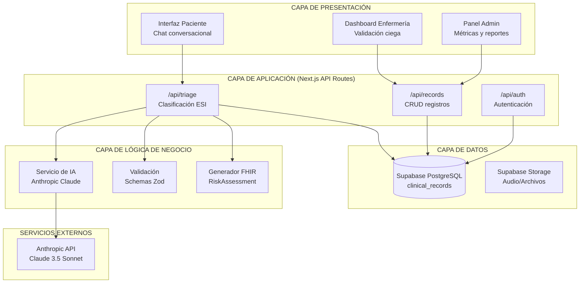
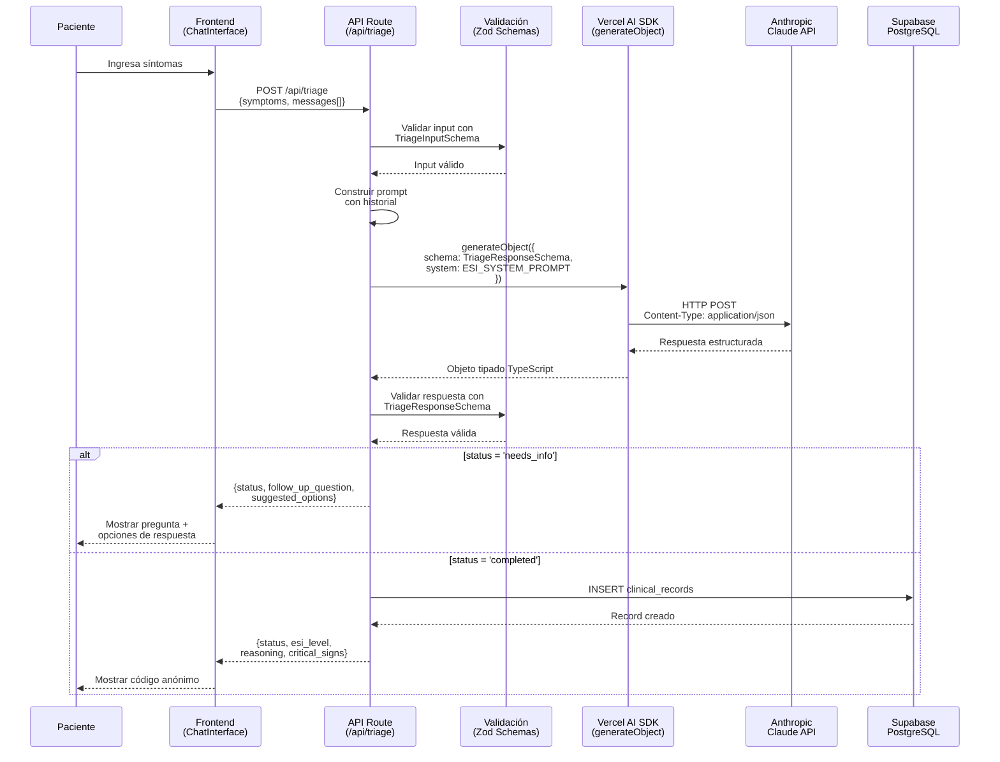
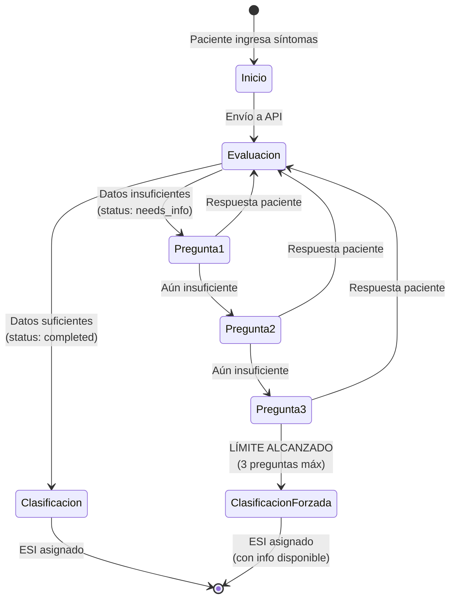
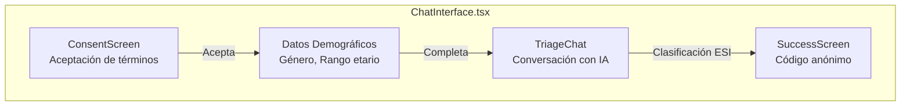
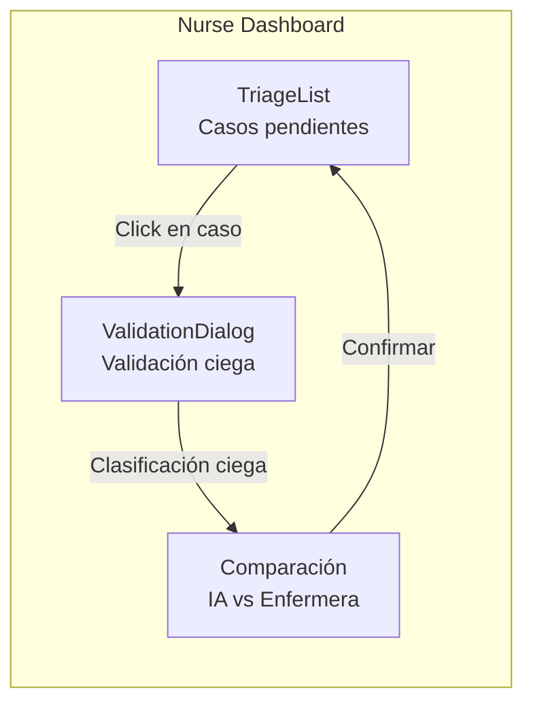
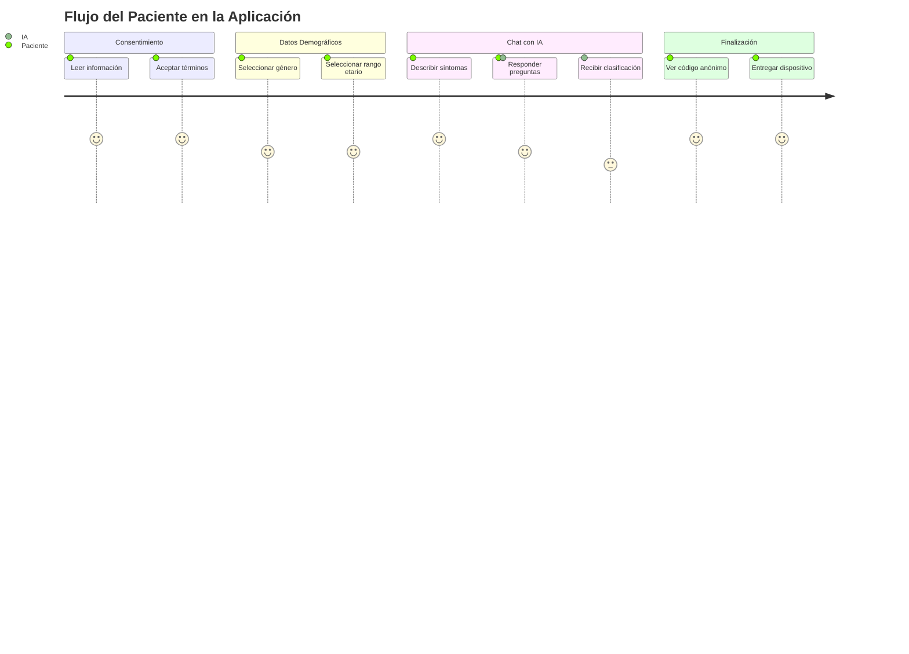
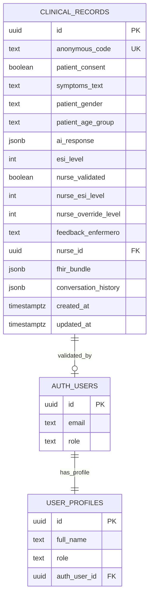
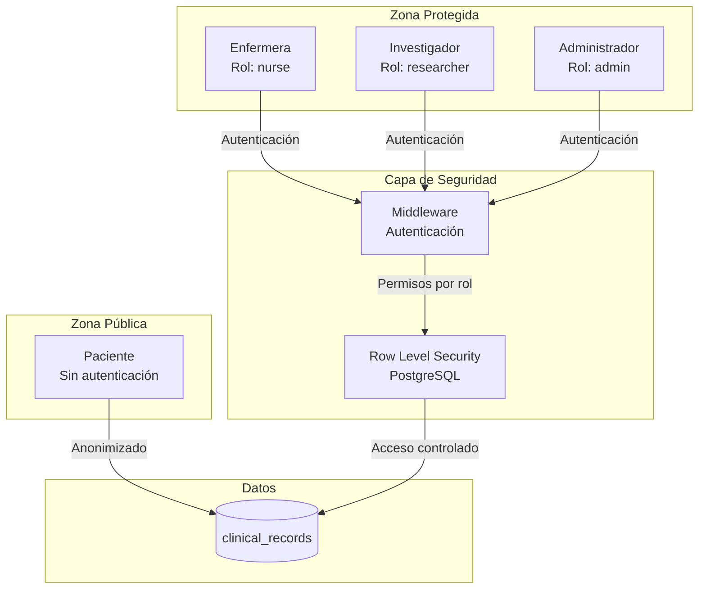
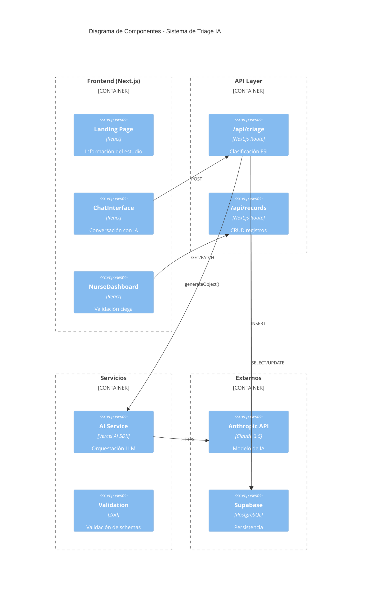

# Estrategia de Desarrollo: Objetivo Específico 3

> **OE3:** Diseñar e implementar la arquitectura funcional de la herramienta digital, integrando servicios de inteligencia artificial mediante APIs previamente entrenadas.

---

## Introducción

El Objetivo Específico 3 constituye la fase de **implementación técnica** del sistema de Triage automatizado. A diferencia de los objetivos anteriores (OE1: modelado clínico, OE2: definición de datos), este objetivo traduce los requerimientos conceptuales en una arquitectura de software funcional, integrando servicios de inteligencia artificial generativa.

El desarrollo se estructuró en cinco actividades principales:

1. **Diseño de arquitectura del sistema** → Arquitectura de capas y componentes
2. **Integración de servicios de IA** → API Anthropic Claude mediante Vercel AI SDK
3. **Implementación de frontend** → Aplicación React/Next.js
4. **Persistencia y base de datos** → Supabase PostgreSQL con Row Level Security
5. **Seguridad y privacidad** → Protección de datos clínicos sensibles

---

## Actividad 1: Diseño de Arquitectura del Sistema

### 1.1 Objetivo

Diseñar una arquitectura de software que cumpla con los requisitos de escalabilidad, seguridad y mantenibilidad necesarios para un sistema de salud digital.

### 1.2 Decisiones Arquitectónicas

#### Tabla 1: Decisiones Arquitectónicas y Justificación

| Decisión | Opción Elegida | Alternativas Consideradas | Justificación |
|----------|----------------|--------------------------|---------------|
| **Paradigma** | Serverless | Monolito, Microservicios | Escalabilidad automática, costo por uso, sin mantenimiento de servidores |
| **Framework Frontend** | Next.js 14 (App Router) | React SPA, Vue, Angular | SSR para SEO, API Routes integradas, excelente DX |
| **Lenguaje** | TypeScript | JavaScript | Type safety crítico para datos médicos |
| **Base de Datos** | PostgreSQL (Supabase) | MongoDB, Firebase | Transacciones ACID, soporte para JSONB y RLS |
| **Proveedor IA** | Anthropic Claude | OpenAI GPT-4, Google Med-PaLM | Mejor razonamiento clínico, mayor ventana de contexto |
| **Hosting** | Vercel | AWS, GCP, Heroku | Integración nativa con Next.js, edge functions |

> [!NOTE]
> **Ajustes respecto al Proyecto Original**
> 
> El proyecto de tesis original planteaba utilizar **React + Flask/Django** como backend y **GPT-4 o Med-PaLM** como modelo de IA. Durante la implementación se realizaron los siguientes ajustes justificados:
> 
> 1. **Backend:** Se optó por **Next.js API Routes** en lugar de Flask/Django para simplificar la arquitectura serverless, reducir la complejidad de despliegue y aprovechar las ventajas del Server-Side Rendering (SSR).
> 
> 2. **Modelo de IA:** Se seleccionó **Anthropic Claude 3.5 Sonnet** por su superior rendimiento en razonamiento clínico estructurado, mayor ventana de contexto (200K tokens), menor latencia, y costo operativo significativamente inferior a GPT-4. Med-PaLM no está disponible comercialmente en Chile.

### 1.3 Arquitectura de Capas



### 1.4 Estructura de Directorios

```
App_tesis_triage/
├── app/                          # Next.js 14 App Router
│   ├── api/                      # API Routes (Serverless)
│   │   ├── triage/
│   │   │   └── route.ts         # Endpoint principal de clasificación
│   │   └── records/
│   │       └── route.ts         # CRUD de registros clínicos
│   ├── (nurse)/                 # Route Group: Dashboard enfermería
│   │   └── dashboard/
│   ├── paciente/                # Interfaz de paciente
│   ├── login/                   # Autenticación
│   └── page.tsx                 # Landing page
│
├── components/                   # Componentes React reutilizables
│   ├── triage/
│   │   └── ChatInterface.tsx    # Chat conversacional con IA
│   ├── dashboard/
│   │   ├── ValidationDialog.tsx # Diálogo de validación ciega
│   │   └── TriageList.tsx       # Lista de casos pendientes
│   └── ui/                      # Componentes base (shadcn/ui)
│
├── lib/                         # Lógica de negocio
│   ├── ai/
│   │   ├── config.ts           # Configuración de Anthropic
│   │   ├── prompts.ts          # System prompt ESI
│   │   └── schemas.ts          # Schemas Zod para validación
│   ├── supabase/
│   │   ├── client.ts           # Cliente browser
│   │   ├── server.ts           # Cliente server-side
│   │   └── types.ts            # Tipos TypeScript
│   └── utils/
│       └── pii-filter.ts       # Sanitización de datos sensibles
│
├── supabase/                    # Configuración de base de datos
│   └── migrations/             # Migraciones SQL
│       ├── 001_clinical_records.sql
│       ├── 002_fhir_mapping.sql
│       └── ...
│
└── middleware.ts               # Autenticación y protección de rutas
```

---

## Actividad 2: Integración de Servicios de Inteligencia Artificial

### 2.1 Objetivo

Integrar un modelo de lenguaje grande (LLM) para el análisis de síntomas y asignación de niveles ESI, utilizando APIs de servicios de IA previamente entrenados.

### 2.2 Selección del Modelo de IA

#### Tabla 2: Comparativa de Modelos de IA para Triage Médico

| Criterio | Anthropic Claude 3.5 | OpenAI GPT-4 | Google Med-PaLM 2 |
|----------|---------------------|--------------|-------------------|
| **Razonamiento clínico** | ⭐⭐⭐⭐⭐ | ⭐⭐⭐⭐ | ⭐⭐⭐⭐⭐ |
| **Ventana de contexto** | 200K tokens | 128K tokens | 32K tokens |
| **Latencia promedio** | ~2-3s | ~3-4s | ~5-6s |
| **Costo por 1M tokens** | $3 input / $15 output | $30 input / $60 output | Enterprise only |
| **Disponibilidad en Chile** | ✅ | ✅ | ❌ |
| **Conformidad médica** | En revisión | En revisión | Certificado |
| **Soporte español** | ⭐⭐⭐⭐⭐ | ⭐⭐⭐⭐⭐ | ⭐⭐⭐⭐ |

**Modelo seleccionado:** Anthropic Claude 3.5 Sonnet (para producción) / Claude 3 Haiku (para desarrollo)

### 2.3 Arquitectura de Integración



### 2.4 Configuración del Modelo

#### Archivo: `lib/ai/config.ts`

```typescript
import { anthropic } from '@ai-sdk/anthropic';

/**
 * Anthropic AI Provider Configuration  
 * Using Claude 3 Haiku for testing (faster and available in all accounts)
 * TODO: Upgrade to Claude 3.5 Sonnet when account has access
 */
export const aiModel = anthropic('claude-3-haiku-20240307');

/**
 * AI Generation Settings
 */
export const AI_CONFIG = {
    temperature: 0.3, // Low temperature for consistent medical reasoning
    maxTokens: 1000,
    topP: 0.9,
} as const;

/**
 * Validate Anthropic API key is configured
 */
export function validateAIConfig(): boolean {
    if (!process.env.ANTHROPIC_API_KEY) {
        console.error('ANTHROPIC_API_KEY is not configured');
        return false;
    }
    return true;
}
```

> [!IMPORTANT]
> **Parámetro de Temperatura**
> 
> Se utiliza una temperatura baja (0.3) para maximizar la **consistencia y reproducibilidad** del razonamiento clínico. Temperaturas altas (>0.7) introducen variabilidad que podría afectar la seguridad del paciente.

### 2.5 Schema de Respuesta Estructurada

#### Archivo: `lib/ai/schemas.ts`

```typescript
import { z } from 'zod';

/**
 * Flexible schema for AI responses with optional fields
 * AI SDK has issues with discriminated unions, so we use optional fields
 * and validate the response type in the API route
 */
export const TriageResponseSchema = z.object({
    // Status field - determines response type
    status: z
        .enum(['completed', 'needs_info'])
        .describe("Response status: 'completed' if AI can classify, 'needs_info' if more information is needed"),

    // Fields for 'completed' status
    esi_level: z
        .number()
        .int()
        .min(1)
        .max(5)
        .optional()
        .describe('Emergency Severity Index Level (1=Critical, 5=Non-Urgent)'),

    critical_signs: z
        .array(z.string())
        .optional()
        .describe('Array of identified critical signs or symptoms'),

    reasoning: z
        .string()
        .optional()
        .describe('Detailed clinical reasoning using medical terminology in Spanish'),

    suggested_specialty: z
        .string()
        .optional()
        .describe('Recommended medical specialty'),

    // Fields for 'needs_info' status
    follow_up_question: z
        .string()
        .optional()
        .describe("Clinical question to clarify ambiguity"),

    suggested_options: z
        .array(z.string())
        .max(5)
        .optional()
        .describe("Quick-reply options for conversational flow"),
});
```

### 2.6 System Prompt del Motor de IA

El prompt del sistema incorpora las reglas de decisión definidas en OE1 y los mecanismos de datos faltantes del OE2:

#### Estructura del System Prompt (`lib/ai/prompts.ts`)

```
┌─────────────────────────────────────────────────────────────┐
│                    ESI_SYSTEM_PROMPT                        │
├─────────────────────────────────────────────────────────────┤
│ 1. REGLA CRÍTICA: Detección de Vaguedad                    │
│    - Ejemplos de inputs vagos                               │
│    - Instrucción de pedir aclaración                        │
│    - Generación de opciones de respuesta                    │
├─────────────────────────────────────────────────────────────┤
│ 2. PROTOCOLO ESI                                            │
│    - Nivel 1: Criterios de intervención inmediata          │
│    - Nivel 2: Criterios de alto riesgo                     │
│    - Niveles 3-5: Conteo de recursos                       │
├─────────────────────────────────────────────────────────────┤
│ 3. INSTRUCCIONES                                            │
│    - Descarte secuencial de niveles                        │
│    - Uso de terminología médica                            │
│    - Principio de precaución                               │
├─────────────────────────────────────────────────────────────┤
│ 4. FORMATO DE RESPUESTA                                     │
│    - Estructura JSON con campos definidos                   │
│    - Status 'completed' vs 'needs_info'                    │
└─────────────────────────────────────────────────────────────┘
```

### 2.7 Control de Flujo Conversacional

El sistema implementa un límite de preguntas de seguimiento para evitar ciclos infinitos:



#### Tabla 3: Parámetros de Control de Flujo

| Parámetro | Valor | Justificación |
|-----------|-------|---------------|
| `MAX_FOLLOW_UP_QUESTIONS` | 3 | Balance entre completitud y usabilidad |
| `CONSENT_KEYWORDS` | Lista de frases | Excluir mensajes de consentimiento del conteo |
| Clasificación forzada | Principio de precaución | Priorizar seguridad cuando hay duda |

---

## Actividad 3: Implementación de Frontend

### 3.1 Objetivo

Desarrollar una interfaz de usuario intuitiva y accesible que permita a pacientes ingresar síntomas y a profesionales de enfermería validar clasificaciones.

### 3.2 Stack Tecnológico Frontend

| Tecnología | Versión | Propósito |
|------------|---------|-----------|
| **Next.js** | 14.x | Framework React con App Router |
| **React** | 18.x | Librería de componentes |
| **TypeScript** | 5.x | Tipado estático |
| **Tailwind CSS** | 3.x | Estilos utilitarios |
| **shadcn/ui** | Latest | Componentes base accesibles |
| **Vercel AI SDK** | 3.x | Hooks para streaming de IA |

### 3.3 Componentes Principales

#### 3.3.1 Interfaz de Chat del Paciente



**Características:**
- Flujo guiado de consentimiento informado
- Chat conversacional con indicador de "escribiendo..."
- Botones de respuesta rápida (suggested_options)
- Alerta visual para ESI 1-2 (casos críticos)
- Código anónimo al finalizar (formato ABC-123)

#### 3.3.2 Dashboard de Enfermería (Validación Ciega)



**Características de Validación Ciega:**

| Fase | Visible | Oculto |
|------|---------|--------|
| **Fase 1** (Ciega) | Síntomas del paciente | Clasificación IA, Razonamiento |
| **Fase 2** (Revelación) | Comparación lado a lado | - |

### 3.4 Diagrama de Flujo de Usuario



---

## Actividad 4: Persistencia y Base de Datos

### 4.1 Objetivo

Implementar un esquema de base de datos que soporte la validación ciega, el cálculo de métricas estadísticas (Kappa), y la interoperabilidad FHIR.

### 4.2 Tecnología: Supabase PostgreSQL

| Característica | Beneficio |
|----------------|-----------|
| **PostgreSQL** | Base de datos relacional robusta |
| **JSONB** | Almacenamiento flexible de respuestas IA |
| **Row Level Security (RLS)** | Seguridad a nivel de fila |
| **Realtime** | Actualizaciones en tiempo real |
| **Auth integrado** | Autenticación de profesionales |

### 4.3 Esquema de Base de Datos

#### Tabla Principal: `clinical_records`

```sql
CREATE TABLE clinical_records (
    -- Identificadores
    id UUID PRIMARY KEY DEFAULT uuid_generate_v4(),
    anonymous_code TEXT UNIQUE,  -- Código paciente (ABC-123)
    
    -- Datos del Paciente
    patient_consent BOOLEAN NOT NULL DEFAULT false,
    symptoms_text TEXT NOT NULL,
    symptoms_voice_url TEXT,  -- Futuro: URL audio
    
    -- Datos Demográficos (Análisis de equidad)
    patient_gender TEXT,        -- 'masculino', 'femenino', 'otro'
    patient_age_group TEXT,     -- '18-64 años', '65 años o más', etc.
    
    -- Clasificación IA
    ai_response JSONB NOT NULL,  -- Respuesta completa de Claude
    esi_level INTEGER NOT NULL CHECK (esi_level BETWEEN 1 AND 5),
    
    -- Validación Enfermería (CRÍTICO PARA KAPPA)
    nurse_validated BOOLEAN DEFAULT false,
    nurse_esi_level INTEGER CHECK (nurse_esi_level BETWEEN 1 AND 5),       -- Clasificación CIEGA
    nurse_override_level INTEGER CHECK (nurse_override_level BETWEEN 1 AND 5), -- Post-revelación
    feedback_enfermero TEXT,    -- Comentarios cualitativos
    nurse_id UUID REFERENCES auth.users(id),
    
    -- Interoperabilidad
    fhir_bundle JSONB,          -- Recurso RiskAssessment FHIR
    conversation_history JSONB,  -- Historial de chat
    
    -- Timestamps
    created_at TIMESTAMPTZ DEFAULT NOW(),
    updated_at TIMESTAMPTZ DEFAULT NOW()
);

-- Índices para consultas frecuentes
CREATE INDEX idx_clinical_records_esi ON clinical_records(esi_level);
CREATE INDEX idx_clinical_records_validated ON clinical_records(nurse_validated);
CREATE INDEX idx_clinical_records_created ON clinical_records(created_at);
```

### 4.4 Diagrama Entidad-Relación



### 4.5 Flujo de Datos para Métricas

#### Cálculo del Coeficiente Kappa

```sql
-- Consulta para Matriz de Confusión IA vs Enfermera
SELECT 
    esi_level AS ai_classification,
    nurse_esi_level AS nurse_classification,
    COUNT(*) AS n
FROM clinical_records
WHERE nurse_esi_level IS NOT NULL
  AND nurse_validated = true
GROUP BY esi_level, nurse_esi_level
ORDER BY esi_level, nurse_esi_level;
```

#### Tabla 4: Campos Críticos para Validación

| Campo | Momento de Captura | Uso en Métricas |
|-------|-------------------|-----------------|
| `esi_level` | INSERT (IA) | Clasificación del algoritmo |
| `nurse_esi_level` | UPDATE Fase 1 (ciega) | Gold standard para Kappa |
| `nurse_override_level` | UPDATE Fase 2 (opcional) | Análisis de influencia IA |

---

## Actividad 5: Seguridad y Privacidad de Datos

### 5.1 Objetivo

Implementar controles de seguridad que protejan los datos clínicos sensibles cumpliendo con la normativa chilena de protección de datos.

### 5.2 Marco Normativo

| Ley | Requisitos Relevantes | Implementación |
|-----|----------------------|----------------|
| **Ley 19.628** | Protección de datos personales | Anonimización con códigos |
| **Ley 21.541** | Interoperabilidad en salud | Formato HL7 FHIR |
| **Ley 21.668** | Transformación digital | Consentimiento digital |

### 5.3 Controles de Seguridad Implementados

#### Tabla 5: Matriz de Controles de Seguridad

| Control | Implementación | Ubicación en Código |
|---------|----------------|---------------------|
| **Anonimización** | Códigos ABC-123 en lugar de nombres | `generateAnonymousCode()` |
| **Sanitización PII** | Filtrado de RUT, teléfonos, direcciones | `lib/utils/pii-filter.ts` |
| **RLS (Row Level Security)** | Políticas de acceso por rol | `supabase/migrations/` |
| **Autenticación** | Supabase Auth con roles | `middleware.ts` |
| **Variables de entorno** | API keys nunca en código | `.env.local` |
| **API Stateless** | Sin logging de datos médicos en Vercel | `app/api/triage/route.ts` |
| **Headers de seguridad** | X-Frame-Options, CSP | `next.config.js` |

### 5.4 Arquitectura de Seguridad



### 5.5 Políticas de Row Level Security

```sql
-- Solo usuarios autenticados con rol 'nurse' pueden actualizar validaciones
CREATE POLICY "Nurses can validate records"
ON clinical_records FOR UPDATE
TO authenticated
USING (
    EXISTS (
        SELECT 1 FROM user_profiles
        WHERE user_profiles.id = auth.uid()
        AND user_profiles.role IN ('nurse', 'admin')
    )
);

-- Investigadores pueden leer pero no modificar
CREATE POLICY "Researchers can view records"
ON clinical_records FOR SELECT
TO authenticated
USING (
    EXISTS (
        SELECT 1 FROM user_profiles
        WHERE user_profiles.id = auth.uid()
        AND user_profiles.role IN ('researcher', 'admin')
    )
);

-- Inserción anónima permitida (para pacientes)
CREATE POLICY "Anonymous insert allowed"
ON clinical_records FOR INSERT
TO anon
WITH CHECK (patient_consent = true);
```

---

## Síntesis y Productos Obtenidos

### Resumen de Entregables del OE3

| Actividad | Producto | Tecnología | Estado |
|-----------|----------|------------|--------|
| Arquitectura del Sistema | Diseño de 4 capas | Next.js + Supabase | ✅ Implementado |
| Integración de IA | Motor de clasificación ESI | Anthropic Claude API | ✅ Operativo |
| Frontend Paciente | Chat conversacional | React + Tailwind | ✅ Funcional |
| Frontend Enfermería | Dashboard validación ciega | React + shadcn/ui | ✅ Funcional |
| Base de Datos | Esquema optimizado para Kappa | PostgreSQL + JSONB | ✅ Migrado |
| Seguridad | RLS + Autenticación + Anonimización | Supabase Auth | ✅ Configurado |

### Diagrama de Componentes Final



---

## Referencias Técnicas

1. Vercel. (2024). *Next.js 14 Documentation*. https://nextjs.org/docs
2. Vercel. (2024). *AI SDK Documentation*. https://sdk.vercel.ai/docs
3. Anthropic. (2024). *Claude API Reference*. https://docs.anthropic.com
4. Supabase. (2024). *Supabase Documentation*. https://supabase.com/docs
5. Zod. (2024). *Zod Documentation*. https://zod.dev
6. HL7 International. (2019). *FHIR R4 RiskAssessment Resource*. https://hl7.org/fhir/R4/riskassessment.html

---

> **Nota del Autor:** Este documento describe la arquitectura e implementación técnica del sistema de Triage automatizado. El código fuente se encuentra en el repositorio del proyecto y puede ser auditado para verificar la conformidad con las especificaciones aquí descritas.
