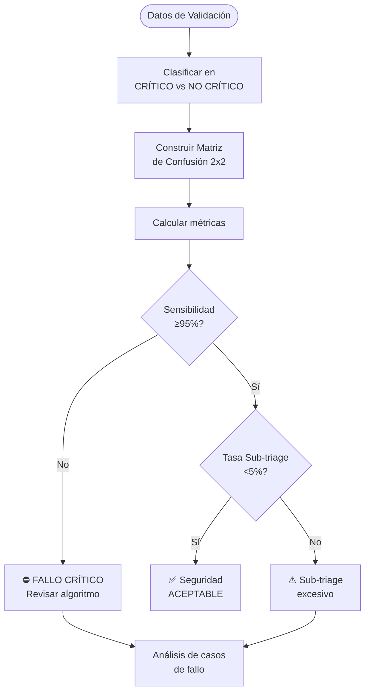
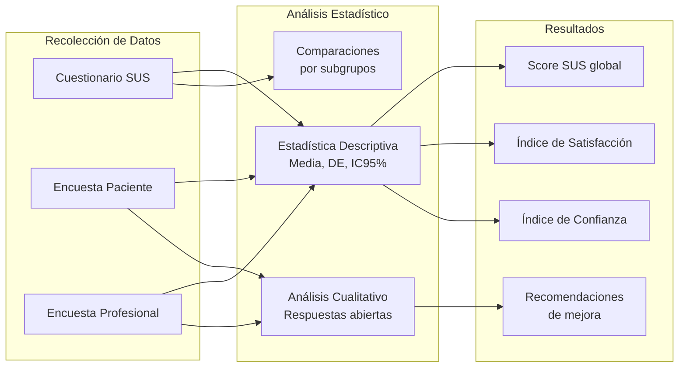
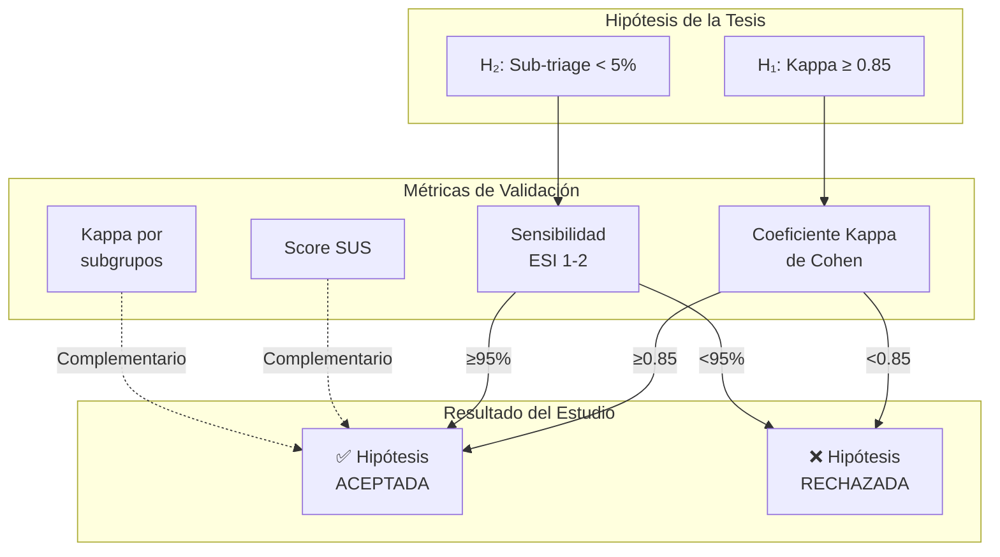

# Estrategia de Desarrollo: Objetivo Específico 4

> **OE4:** Evaluar integralmente el desempeño de la herramienta en el piloto clínico, mediante la validación de su concordancia (Índice Kappa) comparando la categorización de urgencia de la IA con la realizada por profesionales de enfermería, el análisis de su seguridad clínica, midiendo la tasa de sub-triage (subestimación de gravedad) en casos clasificados como ESI I y II por el estándar profesional y la medición de su aceptación y usabilidad por parte de los pacientes y el personal clínico, mediante encuestas de percepción.

---

## Introducción

El Objetivo Específico 4 constituye la fase de **validación clínica** del sistema de Triage automatizado. A diferencia de los objetivos anteriores (OE1-3: diseño e implementación), este objetivo evalúa empíricamente el desempeño del sistema en un entorno clínico real, utilizando métricas estadísticas y herramientas de evaluación validadas.

La validación se estructura en cuatro dimensiones complementarias:

1. **Concordancia** → Coeficiente Kappa de Cohen (IA vs. Enfermería)
2. **Seguridad clínica** → Tasa de sub-triage en casos ESI I-II
3. **Usabilidad** → Encuestas de percepción (pacientes y profesionales)
4. **Análisis de equidad** → Desagregación por variables demográficas

---

## Actividad 1: Diseño del Piloto Clínico

### 1.1 Objetivo

Establecer el marco metodológico del estudio piloto que permita la evaluación rigurosa del sistema de Triage automatizado en un contexto clínico controlado.

### 1.2 Diseño del Estudio

#### Tabla 1: Características del Diseño

| Elemento | Especificación |
|----------|---------------|
| **Tipo de estudio** | Cuantitativo, analítico, transversal |
| **Diseño** | Estudio de concordancia diagnóstica |
| **Método de validación** | Validación ciega (doble evaluación independiente) |
| **Gold Standard** | Clasificación ESI por enfermería profesional |
| **Prueba evaluada** | Clasificación ESI por sistema de IA |

### 1.3 Población y Muestra

#### Tabla 2: Criterios de Inclusión y Exclusión

| Criterio | Inclusión | Exclusión |
|----------|-----------|-----------|
| **Edad** | ≥18 años | Menores de edad |
| **Condición clínica** | Consulta aguda no crítica | Pacientes ESI 1 (críticos) |
| **Capacidad** | Orientados, capaces de consentir | Barreras cognitivas o idiomáticas |
| **Contexto** | Urgencias generales | Urgencias obstétricas (embarazos) |
| **Consentimiento** | Firma de consentimiento informado | Rechazo a participar |

#### Tabla 3: Cálculo de Tamaño Muestral

| Parámetro | Valor | Justificación |
|-----------|-------|---------------|
| **Kappa esperado (H₁)** | ≥0.85 | Hipótesis de investigación |
| **Kappa mínimo aceptable (H₀)** | 0.70 | Concordancia sustancial |
| **Nivel de significancia (α)** | 0.05 | Convencional |
| **Power (1-β)** | 0.80 | 80% de poder estadístico |
| **n mínimo calculado** | ~200 | Basado en fórmula de Donner |
| **n objetivo con pérdidas (15%)** | 230-300 | Margen de seguridad |

#### Justificación Matemática del Tamaño Muestral

El cálculo del tamaño muestral se realizó utilizando la **fórmula de Donner** para estudios de concordancia interobservador:

$$n = \frac{2 \cdot (Z_{\alpha/2} + Z_{\beta})^2 \cdot \sigma^2_{\kappa}}{(\kappa_1 - \kappa_0)^2}$$

Donde:
- $\kappa_1 = 0.85$ → Kappa esperado bajo hipótesis alternativa (H₁)
- $\kappa_0 = 0.70$ → Kappa mínimo aceptable bajo hipótesis nula (H₀)
- $Z_{\alpha/2} = 1.96$ → Valor crítico para $\alpha = 0.05$ (dos colas)
- $Z_{\beta} = 0.84$ → Valor crítico para poder = 80%
- $\sigma^2_{\kappa} \approx 0.02$ → Varianza estimada del Kappa para 5 categorías con distribución aproximadamente uniforme

**Sustituyendo valores:**

$$n = \frac{2 \cdot (1.96 + 0.84)^2 \cdot 0.02}{(0.85 - 0.70)^2} = \frac{2 \cdot 7.84 \cdot 0.02}{0.0225} = \frac{0.3136}{0.0225} \approx 139$$

> [!NOTE]
> El valor calculado (~139) se ajustó a **n = 200** considerando:
> - Mayor estabilidad en la matriz de confusión 5×5
> - Subgrupos demográficos para análisis de equidad
> - Recomendaciones de literatura para escalas ordinales (Sim & Wright, 2005)

Con un 15% de pérdida esperada: $n_{objetivo} = 200 / 0.85 \approx 235$ → Rango **230-300**.

### 1.4 Flujo del Estudio

```mermaid
flowchart TD
    START([Paciente llega a Urgencia]) --> CONSENT{¿Cumple criterios<br>y consiente?}
    
    CONSENT -->|No| EXCL[Excluido del estudio]
    CONSENT -->|Sí| RAND[Ingreso al estudio]
    
    RAND --> PARALLEL
    
    subgraph PARALLEL [Evaluación Paralela Independiente]
        direction LR
        AI[Sistema IA<br>Clasificación ESI]
        NURSE[Enfermera<br>Clasificación ESI]
    end
    
    PARALLEL --> BLIND[Ambas clasificaciones<br>se registran ANTES<br>de compararse]
    
    BLIND --> REVEAL[Enfermera ve<br>clasificación IA]
    
    REVEAL --> DECISION{¿Mantiene o<br>modifica?}
    
    DECISION -->|Mantiene| STORE1[Guardar:<br>- esi_level (IA)<br>- nurse_esi_level (original)]
    DECISION -->|Modifica| STORE2[Guardar:<br>- esi_level (IA)<br>- nurse_esi_level (original)<br>- nurse_override_level (final)]
    
    STORE1 --> ANALYSIS([Análisis estadístico])
    STORE2 --> ANALYSIS
```

### 1.5 Mecanismo de Validación Ciega

> [!IMPORTANT]
> **Principio de Cegamiento**
> 
> La enfermera **DEBE** registrar su clasificación ESI **ANTES** de ver la sugerencia de la IA. Este diseño elimina el sesgo de anclaje y permite calcular un Kappa no contaminado.

#### Implementación Técnica

```
┌─────────────────────────────────────────────────────────────┐
│                 FASE 1: VALIDACIÓN CIEGA                    │
├─────────────────────────────────────────────────────────────┤
│                                                             │
│  👁️ VISIBLE:                                                │
│  • Síntomas descritos por el paciente                      │
│  • Datos demográficos                                       │
│                                                             │
│  ❌ OCULTO:                                                 │
│  • Clasificación ESI de la IA                              │
│  • Razonamiento de la IA                                   │
│  • Signos críticos detectados                              │
│                                                             │
│  Enfermera selecciona: [ESI 1] [ESI 2] [ESI 3] [ESI 4] [ESI 5] │
│                                                             │
│  [🔓 Clasificar y Ver Sugerencia IA]                       │
│                                                             │
└─────────────────────────────────────────────────────────────┘
                              │
                              ▼
┌─────────────────────────────────────────────────────────────┐
│             FASE 2: COMPARACIÓN Y DECISIÓN FINAL            │
├─────────────────────────────────────────────────────────────┤
│                                                             │
│  ┌────────────────┐      ┌────────────────┐                │
│  │ Su clasificación│  VS  │ Clasificación IA│               │
│  │     ESI 3      │      │     ESI 2       │               │
│  └────────────────┘      └────────────────┘                │
│                                                             │
│  ⚠️ Discrepancia detectada                                  │
│                                                             │
│  Razonamiento IA:                                          │
│  "Dolor torácico con características isquémicas..."        │
│                                                             │
│  ¿Desea modificar su clasificación?                        │
│  [Mantener ESI 3] [Cambiar a ESI 2] [Otro nivel]          │
│                                                             │
└─────────────────────────────────────────────────────────────┘
```

---

## Actividad 2: Cálculo de Concordancia (Coeficiente Kappa)

### 2.1 Objetivo

Cuantificar el grado de acuerdo entre el sistema de IA y el profesional de enfermería para la clasificación de Triage según ESI, utilizando el Coeficiente Kappa de Cohen.

### 2.2 Marco Teórico

#### ¿Por qué Kappa y no solo porcentaje de acuerdo?

El **porcentaje de acuerdo simple** puede ser engañoso porque no descuenta el acuerdo esperado por azar. El **Coeficiente Kappa** corrige este problema:

$$\kappa = \frac{P_o - P_e}{1 - P_e}$$

Donde:
- $P_o$ = Proporción de acuerdo observado
- $P_e$ = Proporción de acuerdo esperado por azar

#### Tabla 4: Interpretación del Coeficiente Kappa

| Valor de Kappa | Interpretación |
|----------------|---------------|
| < 0.00 | Acuerdo peor que el azar |
| 0.00 – 0.20 | Acuerdo leve |
| 0.21 – 0.40 | Acuerdo regular |
| 0.41 – 0.60 | Acuerdo moderado |
| 0.61 – 0.80 | Acuerdo sustancial |
| **0.81 – 1.00** | **Acuerdo casi perfecto** |

> **Hipótesis del estudio:** κ ≥ 0.85 (acuerdo casi perfecto)

### 2.3 Matriz de Confusión

La concordancia se evalúa mediante una matriz de confusión 5x5 para los niveles ESI:

#### Tabla 5: Matriz de Confusión ESI (IA vs. Enfermería)

|  | **Enfermera ESI 1** | **Enfermera ESI 2** | **Enfermera ESI 3** | **Enfermera ESI 4** | **Enfermera ESI 5** | **Total IA** |
|---|---|---|---|---|---|---|
| **IA ESI 1** | n₁₁ | n₁₂ | n₁₃ | n₁₄ | n₁₅ | n₁· |
| **IA ESI 2** | n₂₁ | n₂₂ | n₂₃ | n₂₄ | n₂₅ | n₂· |
| **IA ESI 3** | n₃₁ | n₃₂ | n₃₃ | n₃₄ | n₃₅ | n₃· |
| **IA ESI 4** | n₄₁ | n₄₂ | n₄₃ | n₄₄ | n₄₅ | n₄· |
| **IA ESI 5** | n₅₁ | n₅₂ | n₅₃ | n₅₄ | n₅₅ | n₅· |
| **Total Enfermera** | n·₁ | n·₂ | n·₃ | n·₄ | n·₅ | **N** |

### 2.4 Cálculo de Kappa Ponderado

Para variables ordinales como ESI, se recomienda el **Kappa Ponderado** (weighted kappa) que considera la gravedad de las discrepancias:

#### Pesos por Discrepancia

| Discrepancia | Peso (Lineal) | Peso (Cuadrático) |
|--------------|---------------|-------------------|
| 0 niveles (acuerdo) | 1.00 | 1.00 |
| 1 nivel | 0.75 | 0.9375 |
| 2 niveles | 0.50 | 0.75 |
| 3 niveles | 0.25 | 0.4375 |
| 4 niveles | 0.00 | 0.00 |

### 2.5 Implementación: Consulta SQL

```sql
-- Consulta para obtener datos de concordancia
SELECT 
    esi_level AS ai_classification,
    nurse_esi_level AS nurse_classification,
    COUNT(*) AS n
FROM clinical_records
WHERE nurse_esi_level IS NOT NULL
  AND nurse_validated = true
  AND patient_consent = true
GROUP BY esi_level, nurse_esi_level
ORDER BY esi_level, nurse_esi_level;
```

### 2.6 Script de Cálculo de Kappa (Python)

```python
import numpy as np
from sklearn.metrics import cohen_kappa_score

def calculate_kappa_metrics(ai_levels: list, nurse_levels: list):
    """
    Calcula métricas de concordancia para validación de Triage
    
    Args:
        ai_levels: Lista de clasificaciones ESI de la IA (1-5)
        nurse_levels: Lista de clasificaciones ESI de enfermería (1-5)
    
    Returns:
        dict con métricas de concordancia
    """
    # Kappa simple (no ponderado)
    kappa_simple = cohen_kappa_score(ai_levels, nurse_levels)
    
    # Kappa ponderado (lineal) - recomendado para ESI
    kappa_linear = cohen_kappa_score(ai_levels, nurse_levels, weights='linear')
    
    # Kappa ponderado (cuadrático)
    kappa_quadratic = cohen_kappa_score(ai_levels, nurse_levels, weights='quadratic')
    
    # Porcentaje de acuerdo exacto
    agreement_exact = np.mean(np.array(ai_levels) == np.array(nurse_levels))
    
    # Porcentaje de acuerdo ±1 nivel
    agreement_adjacent = np.mean(np.abs(np.array(ai_levels) - np.array(nurse_levels)) <= 1)
    
    return {
        'kappa_simple': round(kappa_simple, 3),
        'kappa_linear': round(kappa_linear, 3),
        'kappa_quadratic': round(kappa_quadratic, 3),
        'agreement_exact': round(agreement_exact * 100, 1),
        'agreement_adjacent': round(agreement_adjacent * 100, 1),
        'n_observations': len(ai_levels),
        'hypothesis_met': kappa_linear >= 0.85
    }
```

---

## Actividad 3: Análisis de Seguridad Clínica (Sub-triage)

### 3.1 Objetivo

Evaluar la seguridad clínica del sistema midiendo la tasa de **sub-triage** (subestimación de gravedad) en casos clasificados como ESI I y II por el estándar profesional.

### 3.2 Definición de Métricas de Seguridad

#### Tabla 6: Definiciones Operacionales de Seguridad

| Término | Definición | Fórmula | Relevancia Clínica |
|---------|------------|---------|-------------------|
| **Sub-triage** | IA asigna nivel menos urgente que enfermera | IA > Enfermera (ej: IA=3, Enfermera=2) | **CRÍTICO**: Puede retrasar atención vital |
| **Sobre-triage** | IA asigna nivel más urgente que enfermera | IA < Enfermera (ej: IA=2, Enfermera=3) | Bajo riesgo: Prioriza seguridad |
| **Sub-triage grave** | Sub-triage en casos ESI 1-2 | IA ≥3 cuando Enfermera ≤2 | **INACEPTABLE**: Riesgo vital |

### 3.3 Operacionalización de Métricas

#### Clasificación Binaria para Análisis de Seguridad

Para el análisis de seguridad, los niveles ESI se agrupan en:

| Grupo | Niveles ESI | Significado |
|-------|-------------|-------------|
| **CRÍTICO** | ESI 1, ESI 2 | Requiere atención inmediata/emergente |
| **NO CRÍTICO** | ESI 3, ESI 4, ESI 5 | Puede esperar según recursos |

#### Tabla 7: Matriz de Confusión Binaria (Crítico vs. No Crítico)

|  | **Enfermera: CRÍTICO (ESI 1-2)** | **Enfermera: NO CRÍTICO (ESI 3-5)** |
|---|---|---|
| **IA: CRÍTICO (ESI 1-2)** | VP (Verdadero Positivo) | FP (Falso Positivo) |
| **IA: NO CRÍTICO (ESI 3-5)** | **FN (Falso Negativo) = SUB-TRIAGE** | VN (Verdadero Negativo) |

### 3.4 Cálculo de Métricas de Seguridad

#### Fórmulas

$$\text{Sensibilidad} = \frac{VP}{VP + FN}$$

$$\text{Especificidad} = \frac{VN}{VN + FP}$$

$$\text{Tasa de Sub-triage} = \frac{FN}{VP + FN} = 1 - \text{Sensibilidad}$$

#### Tabla 8: Umbrales de Aceptabilidad

| Métrica | Umbral Aceptable | Justificación |
|---------|------------------|---------------|
| **Sensibilidad (ESI 1-2)** | ≥95% | Detectar casi todos los casos críticos |
| **Tasa de Sub-triage** | <5% | Hipótesis del estudio |
| **Especificidad** | ≥70% | Balance con sobre-triage |

> [!CAUTION]
> **Prioridad Absoluta: Seguridad del Paciente**
> 
> Una tasa de sub-triage >5% en casos ESI 1-2 es **inaceptable** y requiere revisión inmediata del sistema. El principio rector es: "Es preferible sobre-clasificar un caso que sub-clasificarlo."

### 3.5 Implementación: Consulta SQL

```sql
-- Cálculo de métricas de seguridad
WITH classifications AS (
    SELECT 
        id,
        CASE WHEN esi_level <= 2 THEN 'CRITICO' ELSE 'NO_CRITICO' END AS ai_class,
        CASE WHEN nurse_esi_level <= 2 THEN 'CRITICO' ELSE 'NO_CRITICO' END AS nurse_class
    FROM clinical_records
    WHERE nurse_esi_level IS NOT NULL AND nurse_validated = true
),
confusion AS (
    SELECT
        SUM(CASE WHEN ai_class = 'CRITICO' AND nurse_class = 'CRITICO' THEN 1 ELSE 0 END) AS verdaderos_positivos,
        SUM(CASE WHEN ai_class = 'CRITICO' AND nurse_class = 'NO_CRITICO' THEN 1 ELSE 0 END) AS falsos_positivos,
        SUM(CASE WHEN ai_class = 'NO_CRITICO' AND nurse_class = 'CRITICO' THEN 1 ELSE 0 END) AS sub_triage,
        SUM(CASE WHEN ai_class = 'NO_CRITICO' AND nurse_class = 'NO_CRITICO' THEN 1 ELSE 0 END) AS verdaderos_negativos,
        COUNT(*) AS total
    FROM classifications
)
SELECT
    verdaderos_positivos,
    falsos_positivos,
    sub_triage,
    verdaderos_negativos,
    total,
    ROUND(verdaderos_positivos::DECIMAL / NULLIF(verdaderos_positivos + sub_triage, 0) * 100, 2) AS sensibilidad_pct,
    ROUND(sub_triage::DECIMAL / NULLIF(verdaderos_positivos + sub_triage, 0) * 100, 2) AS tasa_subtriage_pct
FROM confusion;
```

### 3.6 Diagrama de Análisis de Seguridad



---

## Actividad 4: Evaluación de Usabilidad (Encuestas)

### 4.1 Objetivo

Evaluar la aceptación y usabilidad del sistema desde la perspectiva de pacientes y profesionales de salud, utilizando instrumentos validados.

### 4.2 Instrumentos de Evaluación

#### Tabla 9: Instrumentos de Usabilidad

| Instrumento | Población Objetivo | Dominios Evaluados | Escala |
|-------------|-------------------|-------------------|--------|
| **System Usability Scale (SUS)** | Pacientes y Profesionales | Usabilidad general | 0-100 |
| **Cuestionario Ad-Hoc** | Pacientes | Claridad, Confianza, Satisfacción | Likert 1-5 |
| **Cuestionario Profesional** | Enfermería | Utilidad clínica, Confianza en IA | Likert 1-5 |

> [!IMPORTANT]
> **Validación de Instrumentos**
> 
> Los cuestionarios ad-hoc (paciente y profesional) serán sometidos a **validación de contenido** mediante juicio de expertos y prueba piloto con 10-15 participantes antes de su aplicación definitiva. El SUS es un instrumento previamente validado en español.

### 4.3 System Usability Scale (SUS)

El SUS es un instrumento validado internacionalmente de 10 ítems que produce un score de 0-100.

#### Tabla 10: Ítems del SUS (Adaptados al Español)

| # | Ítem | Orientación |
|---|------|-------------|
| 1 | Creo que me gustaría utilizar este sistema frecuentemente | Positivo |
| 2 | Encontré el sistema innecesariamente complejo | Negativo |
| 3 | Pensé que el sistema era fácil de usar | Positivo |
| 4 | Creo que necesitaría el apoyo de un técnico para poder usar este sistema | Negativo |
| 5 | Encontré que las funciones del sistema estaban bien integradas | Positivo |
| 6 | Pensé que había demasiada inconsistencia en este sistema | Negativo |
| 7 | Me imagino que la mayoría de las personas aprenderían a usar este sistema muy rápidamente | Positivo |
| 8 | Encontré el sistema muy difícil de usar | Negativo |
| 9 | Me sentí muy confiado/a al usar el sistema | Positivo |
| 10 | Necesité aprender muchas cosas antes de poder empezar a usar este sistema | Negativo |

#### Cálculo del Score SUS

1. Para ítems positivos (1, 3, 5, 7, 9): restar 1 a la respuesta
2. Para ítems negativos (2, 4, 6, 8, 10): restar la respuesta de 5
3. Sumar todos los valores y multiplicar por 2.5

**Interpretación:**
| Score SUS | Interpretación | Grado |
|-----------|---------------|-------|
| 0-50 | No aceptable | F |
| 51-67 | Marginal | D |
| 68-80 | Aceptable | C |
| 80-84 | Bueno | B |
| 85-100 | Excelente | A |

### 4.4 Cuestionario de Percepción del Paciente

#### Tabla 11: Ítems del Cuestionario del Paciente

| Dimensión | Ítem | Escala |
|-----------|------|--------|
| **Claridad** | Las instrucciones del sistema fueron claras y fáciles de entender | Likert 1-5 |
| **Claridad** | Fue fácil describir mis síntomas al sistema | Likert 1-5 |
| **Confianza** | Confío en la evaluación que realizó el sistema | Likert 1-5 |
| **Confianza** | Me sentí seguro/a utilizando esta herramienta | Likert 1-5 |
| **Satisfacción** | En general, estoy satisfecho/a con la experiencia de uso | Likert 1-5 |
| **Recomendación** | Recomendaría este sistema a otras personas | Likert 1-5 |
| **Preferencia** | Preferiría usar este sistema antes de ir presencialmente a urgencias menores | Likert 1-5 |
| **Abierta** | ¿Qué mejoraría del sistema? | Texto libre |

### 4.5 Cuestionario de Percepción del Profesional

#### Tabla 12: Ítems del Cuestionario del Profesional de Enfermería

| Dimensión | Ítem | Escala |
|-----------|------|--------|
| **Utilidad clínica** | El sistema proporciona información útil para el proceso de triage | Likert 1-5 |
| **Utilidad clínica** | El razonamiento clínico mostrado por la IA es comprensible | Likert 1-5 |
| **Confianza** | Confío en las clasificaciones sugeridas por la IA | Likert 1-5 |
| **Confianza** | La IA identifica correctamente los casos de alto riesgo (ESI 1-2) | Likert 1-5 |
| **Impacto laboral** | El sistema podría ayudar a optimizar el flujo de trabajo | Likert 1-5 |
| **Impacto laboral** | El sistema es una herramienta de apoyo, no de reemplazo | Likert 1-5 |
| **Adopción** | Estaría dispuesto/a a utilizar este sistema en mi práctica habitual | Likert 1-5 |
| **Abierta** | ¿En qué casos la IA difiere más de su criterio clínico? | Texto libre |

### 4.6 Análisis de Resultados de Usabilidad



---

## Actividad 5: Análisis de Equidad

### 5.1 Objetivo

Evaluar si el desempeño del sistema es equitativo entre diferentes grupos demográficos, identificando potenciales sesgos algorítmicos.

### 5.2 Variables de Estratificación

| Variable | Categorías | Análisis |
|----------|------------|----------|
| **Género** | Masculino, Femenino, Otro | Kappa por grupo |
| **Grupo etario** | 18-64 años, 65+ años | Kappa por grupo |
| **Nivel ESI** | 1-2 (críticos), 3-5 (no críticos) | Sensibilidad por grupo |

### 5.3 Análisis Estratificado

```sql
-- Kappa por grupo demográfico
SELECT 
    patient_gender,
    patient_age_group,
    COUNT(*) AS n,
    -- Métricas de concordancia se calculan por grupo
    AVG(CASE WHEN esi_level = nurse_esi_level THEN 1 ELSE 0 END) AS agreement_rate
FROM clinical_records
WHERE nurse_esi_level IS NOT NULL
GROUP BY patient_gender, patient_age_group
ORDER BY patient_gender, patient_age_group;
```

---

## Síntesis y Productos Obtenidos

### Resumen de Entregables del OE4

| Actividad | Producto | Métrica Principal | Umbral de Éxito |
|-----------|----------|-------------------|-----------------|
| Diseño del Piloto | Protocolo de estudio | N ≥ 200 | Potencia ≥ 80% |
| Concordancia | Coeficiente Kappa | κ (ponderado) | ≥ 0.85 |
| Seguridad Clínica | Tasa de Sub-triage | FN / (VP + FN) | < 5% |
| Usabilidad | Score SUS | 0-100 | ≥ 68 (aceptable) |
| Equidad | Kappa estratificado | Por demografía | Sin diferencias significativas |

### Diagrama de Integración de Métricas



---

## Referencias Metodológicas

1. Cohen, J. (1960). A coefficient of agreement for nominal scales. *Educational and Psychological Measurement*, 20(1), 37-46.
2. Landis, J. R., & Koch, G. G. (1977). The measurement of observer agreement for categorical data. *Biometrics*, 33(1), 159-174.
3. Brooke, J. (1996). SUS: A "quick and dirty" usability scale. *Usability Evaluation in Industry*, 189-194.
4. Gilboy, N., et al. (2020). *Emergency Severity Index (ESI): A Triage Tool for Emergency Department Care, Version 4*.
5. Donner, A., & Rotondi, M. A. (2010). Sample size requirements for interval estimation of the kappa statistic for interobserver agreement studies. *Statistics in Medicine*, 29(9), 936-946.

---

> **Nota del Autor:** Este documento describe el marco metodológico para la validación clínica del sistema. Los instrumentos de evaluación (encuestas) deberán ser adaptados culturalmente y sometidos a revisión del Comité de Ética antes de su aplicación. Los análisis estadísticos se realizarán con software R o Python (scipy, sklearn).
